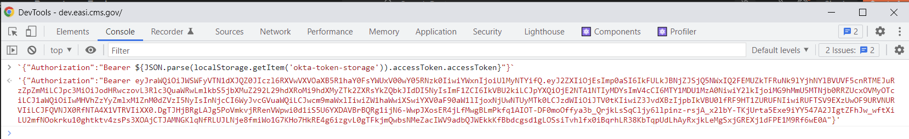
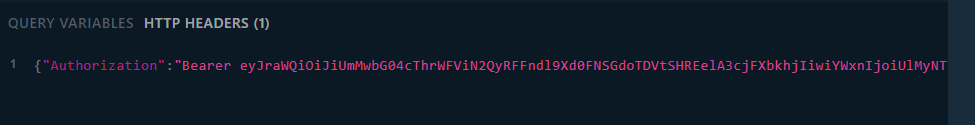

# GraphQL Playground

## Running Locally

You can visit `http://localhost:8080/api/graph/playground` to access a GraphQL playground while the Go backend is running. You will need to enter `/api/graph/query` as the query path in the UI for this to work. You'll also need to add the following to HTTP Headers (in the lower-left) to avoid auth errors:
```
{ "Authorization":"Local {\"favorLocalAuth\":true}"}
```

Additionally, you can define EUA job codes in the `Authorization` header that will be used when querying endpoints such as `systemIntake` that require them. The syntax is:
```
{ "Authorization":"Local {\"favorLocalAuth\":true, \"jobCodes\":[\"EASI_D_GOVTEAM\"]}"}
```
Additional job codes beyond/instead of `EASI_D_GOVTEAM` can be included in the `jobCodes` array, just make sure to escape the `"`'s around the job code names.

## Running in Deployed Environments

The GraphQL playground can also be used in the deployed dev/impl/prod environments. Access it with the same `/api/graph/playground` path, with the appropriate domain, i.e. `https://dev.easi.cms.gov/api/graph/playground`. You'll still need to enter `/api/graph/query` in the playground UI. To authenticate, you'll need to log in to the environment, then get the Bearer token returned by Okta. The easiest way to do this is by opening the browser dev tools, then running the following command:

```
JSON.parse(localStorage.getItem('okta-token-storage')).accessToken.value
```

This will return a long base64-encoded string:




Copy the string (_without_ the surrounding quotes). In the GraphQL playground, in HTTP Headers, enter 
```
{"Authorization":"Bearer <insert token here>"}
```
to authenticate your requests.


